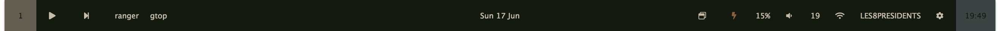
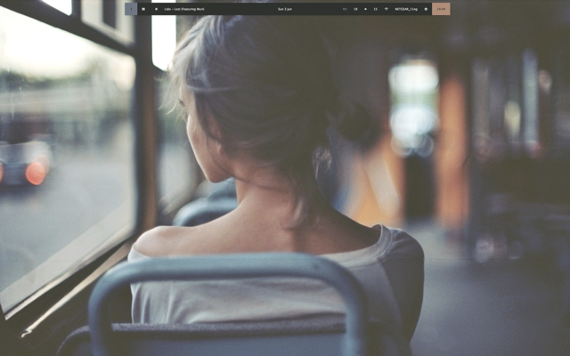
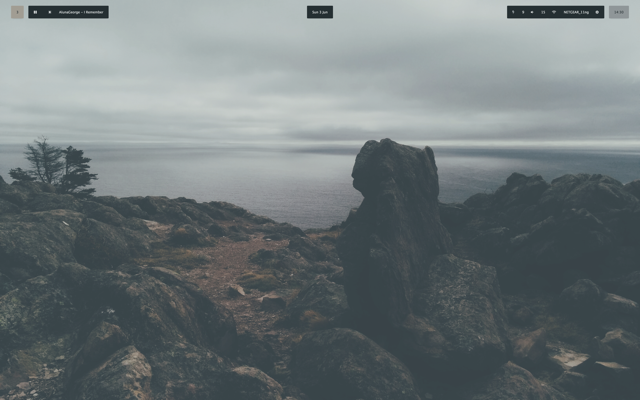
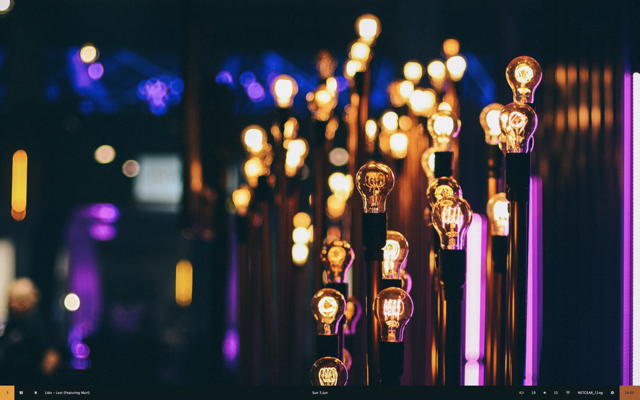
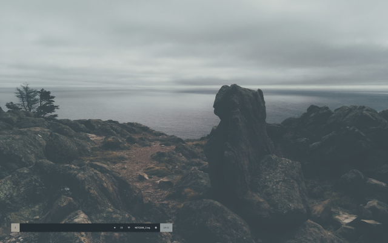
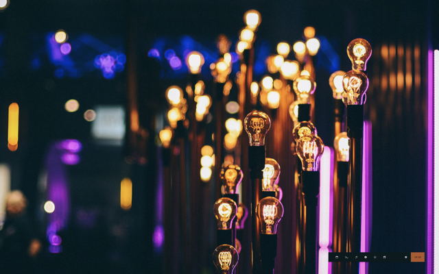

<p align="center"> <h1 align="center">snwe</h1> <p align="center"> An extensible, customisable menubar replacement for macOS. </p>
 </p>
<hr/>




This widget puts everything you might want to know at a glance in one place. From system monitoring, to currently playing music, the bar gives you an overview of what you need to know.


Thanks to the program's modular structure, it's trivial to extend it with new indicators or graphic themes. The wal-responsive adaptive colorscheme makes it always look at home.





And the widget selection allows you to tailor it to your needs





## Yes but what does it do
The bar is undergoing *very* active development. I'm adding, modifying, and moving around functions on a weekly basis. The list of displays that follows is indicative and relative only to the default configuration which can be very easily switched up with any of the other configuration files that are included in the download.

* Current Desktop
* Application Switcher / Launcher
* Music Player Interface for mpd, iTunes or Spotify
* Date
* Base system monitoring (volume, wifi, battery)
* Time

# Installation
(By this point we both know you want it.)

## Prebuilt Binaries
#### No installation, no fuss – just download and run

1. Head over to the [release](https://github.com/blahsd/snwe/releases) page
2. Download the latest release
3. Run.

## NPM Install
#### For developing and customising

Please note that you might already have Brew, npm, or both, installed. In this case you can skip a couple steps!

1. Install Brew. In a terminal, run  

```
ruby -e "$(curl -fsSL https://raw.githubusercontent.com/Homebrew/install/master/install)" < /dev/null 2>  /dev/null ; brew install caskroom/cask/brew-cask 2> /dev/null
```

2. Install npm. In a terminal, run

```
brew install npm
```

3. Clone this repo (copy the files on your machine). Run:

```
git clone https://github.com/blahsd/snwe.git
```

4. Navigate to wherever you cloned the repo and:

```
npm install
npm start
```

### Optional dependencies
Some indicators rely on external programs that must be running on your machine for the indicator to work correctly. All of the following dependencies are **optional** – if you don't have them the bar will still work correctly, although with some functionalities impaired.

#### Desktop indicator
* Uses [chunkwm](https://github.com/koekeishiya/chunkwm)

Installing chunkwm is trivial and takes just a couple of minutes. Regardless of whether you are going to use this bar, I recommend it wholeaheartedly. Still, it's a complex system, and I recommend you check out the link above and make an informed decision before installing.

These are the homebrew commands to install chunkwm:

```
# clone tap
brew tap crisidev/homebrew-chunkwm

# install latest stable version
brew install chunkwm

# install from git repo
brew install --HEAD chunkwm
```

**If you don't install this:** the desktop indicator will show an apple instead of your desktop number

#### mpd indicator
* Uses [mpd](https://github.com/MusicPlayerDaemon/MPD) (no shit)

**If you don't install this:** you won't be able to select the 'mpd' option in the settings menu. You'll still be able to select iTunes or Spotify, so you're good.

#### wal-responsive styling
* Uses [pywal](https://github.com/dylanaraps/pywal) to generate and change color-schemes on the fly.

**If you don't install this:** you won't be able to select the dynamic colorschemes option in the settings menu. You will have the default colorschemes available and any that you might add yourself.

# Usage
I will get around to write this paragraph, I promise. But honestly just run it, it's super simple.

# Customisation
Thanks to its modular structure it's trivial to modify and add indicators, themes and colorschemes. In order to have a version that's more manageable to customise, I recommend installing the npm version, rather than the prebuilt.

## Indicators
Reside in `./app/js/require/modules/`.

Check out any of them to get a feel for how they work. The Date and Time indicators are the simplest, so they are a good place to start looking. All indicators must extend the `ExternalModule` class, which you can find in `./app/js/require/ExternalModule.js`.

## Themes and Colorschemes
Reside in `./app/css/`.

Themes change the overall appearance of the bar. They should not include any color indication.

Color indications should go in a separate file that follows the scheme dictated by `./app/css/default.css`.

# Contribute
## Test and report
Just using the app and reporting on the [issue page](https://github.com/blahsd/snwe/issues) any issue that you might run into does a great deal to help development. I'm also very appreciative of issues that don't report an issue but rather indicate a useful feature that is missing / a feature wishlist / UX improvements / ecc.

## Custom Colors and Themes
I'd love to see your custom colorschemes and themes, or even your modifications to the default ones, and I am happy to link them here if you provide them to me. Hell, they might make it in the distributed package.

## Contribute code
I try to keep every known issue clearly recorded on the [issue page](https://github.com/blahsd/snwe/issues).
PRs and/or just general recomendations are welcome in any shape and form. My code is mostly shit so go right ahead and change as your heart desires. You're probably gonna do a better job than me. Refactors are also welcome.

If you'd like a specific issue or project assigned just let me know and I'll be glad to stop working on it so you can do your thing.

# Credits

* [paanvaannd](https://github.com/paanvaannd): testing, debugging, and contributing to development.

* [davidlday](https://github.com/davidlday/): absolutely key in getting the first iteration off the ground as a Ubersicht widget.

*  [splintah/nerdbar.widget](https://github.com/splintah/nerdbar.widget): tons of code that I took shamelessly and adapted/expanded, again, for the previous incarnation of this bar.

* some builds might include icons by [freepik](http://www.freepik.com) via [flaticon](https://www.flaticon.com/) and they want me to tell you that they are  licensed under [CC 3.0 BY](http://creativecommons.org/licenses/by/3.0/), so, huh, there's that.

* Me. I mean, I think I did a pretty good job. [Buy me a coffee](https://ko-fi.com/V7V3DTSF) or [send thoughts & prayers](https://www.thoughtsandprayersthegame.com).
